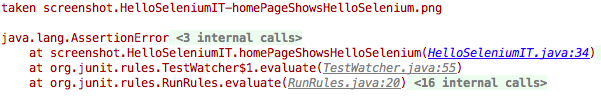

Problem
---

* A test fails and you can't determine the reason it failed because the browser closes before you have a chance to see what happened.
* A test fails on your CI server, but passes locally and you want more information to diagnose it.
* A test does not provide enough information to diagnose it.

Solution
---

1. Expose the web driver's ability to take screen shots.
1. Take a screenshot when a test fails.
1. Copy that screen shot somewhere we can access it later on.

You can find the code for this tutorial on [Github](https://github.com/alexec/selenium-webdriver/tree/master/taking-a-screenshot). 

To get started quickly, start this hello word application:

~~~bash
git clone https://github.com/alexec/selenium-webdriver.git
cd selenium-webdriver/taking-a-screenshot
mvn jetty:run
~~~

Lets create a simple test:

~~~java
public class HelloSeleniumIT {

    private final WebDriver driver = new FirefoxDriver();

    @After
    public void tearDown() throws Exception {
        driver.close();
    }

    @Test
    public void homePageShowsHelloSelenium() throws Exception {

        driver.get("http://localhost:8080");

        WebElement heading = driver.findElement(By.cssSelector("h2"));

        assertTrue(heading.getText().contains("Hello Selenium!"));
    }
}
~~~

Running this test shows:

If the above image we can see the error we get from this is not very clear. Instead we need to take a screenshot. To do this, we'll use a feature of JUnit called "rules" (see <https://github.com/junit-team/junit/wiki/Rules>). A rule is essentially an object that listens to a test. We'll listen to failures and take a screen shot when one occurs:

~~~java
public class ScreenshotTaker extends TestWatcher {
    private final TakesScreenshot takesScreenshot;

    public ScreenshotTaker(TakesScreenshot takesScreenshot) {
        this.takesScreenshot = takesScreenshot;
    }

    @Override
    protected void failed(Throwable e, Description description) {
        File screenshot = takesScreenshot.getScreenshotAs(OutputType.FILE);
        System.err.println("taken " + screenshot);
    }
}
~~~

And add this line to our test and run:

~~~java
@Rule
public TestRule screenshotTaker = new ScreenshotTaker((TakesScreenshot) driver);
~~~

Re-running the test shows:

You'll notice that the screen shot has been saved in a temporary file, and you'll also note that the name isn't very descriptive. This will be deleted  when the test finishes. We'll need to copy this somewhere safe. Update ScreenshotTaker as follows:

~~~java
@Override
protected void failed(Throwable e, Description description) {
    File screenshot = new File(description.getClassName() + "-" + description.getMethodName() + ".png");

    try {
        FileUtils.moveFile(takesScreenshot.getScreenshotAs(OutputType.FILE), screenshot);
    } catch (IOException e1) {
        throw new RuntimeException(e1);
    }

    System.err.println("taken " + screenshot);
}
~~~

You can now see in the above screenshot that we've saved the file with a clear name.

Discussion
---

Taking screenshots help debugging. We need to tie in with the testing process to take them, and we need to make sure we name that file in a helpful fashion.
