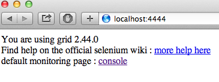
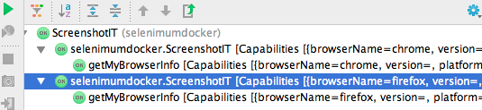
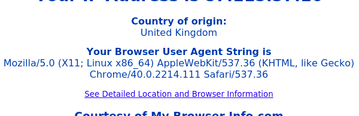

## Problem
You want to do **Visual Testing** to make sure the same web site looks and acts the same in different browsers. However, a normal Selenium WebDriver unit test only uses a single browser, and you want to avoid copy and pasting the test with different drivers in it.

## Solution

1. Set-up a **mini Selenium Grid**, hosted on your desktop using Docker.
2. Create a **`WebDriverSupplier`** to give us the appropriate driver for our test.
3. Create a **JUnit runner** that runs your test multiple times, using `@Inject` to set the driver, and allowing you to take a screenshot on multiple browsers, but having to write only one test.
4. Create a **unit test** that uses the runner.

### Mini-Selenium Grid
You'll want to get the code for this to start with:

~~~
git clone https://github.com/alexec/selenium-visual-testing.git
cd selenium-visual-testing
~~~

If you don't have access to a Selenium Grid, but you have access to Docker, the code for this project has is a mini-grid you can run locally:

~~~
mvn docker:package
mvn docker:start
~~~

After some time, this starts up a Selenium Hub with one Chrome and one Firefox node. This will allow you to test in those two browsers. You can stop the grid at any time if you've done using:

~~~
mvn docker:stop
~~~
		
You can check your grid is up by opening <http://localhost:4444> and you should see this:

### Creating A Web Driver Supplier

To make it easy to change driver in our tests, you're going to create a class called `WebDriverSupplier`. This will provide an instance of a `WebDriver`, based on the capabilities you request. This a good pattern to use with Selenium, as it allows you to change the driver, without having to change your tests. It can also make sure that we clean up our driver after you've finished with it.

How will it work?

1. If it already has created a web driver for the capabilities you ask for, return it.
2. Otherwise, close the current driver, and create a new one matching the requested capabilities.

~~~java
public class WebDriverSupplier implements Closeable {

    private WebDriver driver;
    private DesiredCapabilities desiredCapabilities;;

    public WebDriver get(DesiredCapabilities desiredCapabilities) {
        // #1 if the driver we already has does not match what we want, close it
        if (!desiredCapabilities.equals(this.desiredCapabilities)) {
            close();
        }
        if (driver == null) {
            try {
                // #2 create a new driver, note that we augment it 
                //    so that it can create screen shots
                this.driver = new Augmenter().augment(new RemoteWebDriver(
                        // #3 this is the URL of out grid, change this to 
                        //    point to your if you're not using docker
                        new URL("http://localhost:4444/wd/hub"),
                        desiredCapabilities));
                this.desiredCapabilities = desiredCapabilities;
            } catch (MalformedURLException e) {
                throw new RuntimeException(e);
            }
        }
        return driver;
    }

    public void close() {
        if (driver != null ) {
            // #4 close the driver down when we've finished with it to free up resources
            driver.close();
            driver = null;
        }
    }
}
~~~

### JUnit Selenium Runner

The next part of our puzzle is a custom JUnit **suite runner**. This is a pretty advanced topic, and it's not often you need to create a runner. However, there are some common examples you may have use such as the `Parameterized` runner, and Spring's `SpringJUnit4ClassRunner`. If you've ever wondered how they work, hopefully you'll gain some clarity here.

Our suite runner is like a factory for tests:

~~~java
public class SeleniumRunner extends Suite {
    private static final WebDriverSupplier WEB_DRIVER_SUPPLIER = new WebDriverSupplier();

    // #1 a list of the different browser configurations we want
    private static final List<DesiredCapabilities> DESIRED_CAPABILITIES =
            asList(DesiredCapabilities.chrome(), DesiredCapabilities.firefox());

    public SeleniumRunner(Class<?> klass) throws InitializationError {
        super(klass, createRunners(klass));
    }

    // #2 this method creates one runner per configuration
    private static List<Runner> createRunners(Class<?> klass) throws InitializationError {
        List<Runner> runners = new ArrayList<Runner>();
        for (DesiredCapabilities desiredCapabilities : DESIRED_CAPABILITIES) {
            // #3 the actual running of the test is delegate to a DesiredCapabilitiesRunner
            //    telling it the capabilities we need
            runners.add(new DesiredCapabilitiesRunner(desiredCapabilities, klass, WEB_DRIVER_SUPPLIER));
        }
        return runners;
    }
}
~~~

Next, you need a class to actually run the test. This is called a **class runner**. You can think of a class as a test. This will be responsible for injecting the web driver into the test class, as well injecting the capabilities of the web driver into the test class, which you'll use later on. Two interesting methods here are `withBefores` and `inject` which perform a primitive form of dependency injection into the test class.

~~~java
class DesiredCapabilitiesRunner extends BlockJUnit4ClassRunner {
    private final DesiredCapabilities desiredCapabilities;
    private final WebDriverSupplier webDriverSupplier;

    DesiredCapabilitiesRunner(DesiredCapabilities desiredCapabilities, Class<?> klass,
                              WebDriverSupplier webDriverSupplier) throws InitializationError {
        super(klass);
        this.desiredCapabilities = desiredCapabilities;
        this.webDriverSupplier = webDriverSupplier;
    }

    private static void inject(Object target, Object bean) {
        // #1 a very primitive form of injection, we simple find any field annotated
        //    with @Inject and if the target has the same class, set it using
        //    standard Java Reflection
        for (Field field : target.getClass().getDeclaredFields()) {
            if (field.getAnnotation(Inject.class) != null &&
                    field.getType().isAssignableFrom(bean.getClass())) {
                try {
                    field.setAccessible(true);
                    field.set(target, bean);
                } catch (IllegalAccessException e) {
                    throw new RuntimeException(e);
                }
            }
        }
    }

    @Override
    protected Statement withBefores(FrameworkMethod method, Object target, Statement statement) {
        // #2 inject the web driver and the capabilities into the test class
        inject(target, webDriverSupplier.get(desiredCapabilities));
        inject(target, desiredCapabilities);
        return super.withBefores(method, target, statement);
    }

    @Override
    protected String getName() {
        // #3 to make sure that the class has a clean name in the IDE
        return String.format("%s [%s]", super.getName(), desiredCapabilities);
    }

    @Override
    protected String testName(final FrameworkMethod method) {
        // #4 as above, make sure that the class is clearly named in the IDE
        return String.format("%s [%s]", method.getName(), desiredCapabilities);
    }
}
~~~

### The Test

Now you've got all this test infrastructure in place, lets put it to work with a test. The site you are going test is <http://mybrowserinfo.com>. This is a useful web site that returns information about the browser being used to view the page, and this will help show that our little framework is working.

~~~java
// #1 you use this annotation to tell JUnit to run the class using your custom runner
@RunWith(SeleniumRunner.class)
public class ScreenshotIT {

    // #2 this is our primitive injection at work
    @Inject
    private WebDriver driver;

    @Inject
    private DesiredCapabilities desiredCapabilities;

    @Test
    public void getMyBrowserInfo() throws Exception {

        driver.get("http://mybrowserinfo.com");

        // #3 using assertThat often give better information when a test fails
        assertThat(driver.findElement(By.tagName("h1")).getText(),
                containsString("Your IP Address is"));

        // #4 take the screen shot, this code is pretty rough and ready, but could easily be refactored
        assert ((TakesScreenshot) driver)
                .getScreenshotAs(OutputType.FILE)
                .renameTo(
                        // #5 create a file name based on the URL and the browser's name, you may 
                        //   want to change this to make it suitable for your purposes
                        new File(driver.getCurrentUrl().replaceAll("[^a-z]", "") + "-"
                                + desiredCapabilities.getBrowserName() + ".png"));
    }
}
~~~

The test `getMyBrowserInfo` has a bit of rough and ready code to take a screenshot, and save it to a file. Run the test and you should see something like this in your IDE:

I hope you can clearly see the same test being run twice, but with different test configurations.

Finally, have a look at the two screen shots you've taken:

## Discussion

This tutorial introduced you to a way to use JUnit runners to run the same test under different configurations. We've used it with Selenium today, but this pattern works with other types of test as well. It is a category of testing called Configuration Testing: testing a system behaves the same, even under different configurations. 

Read more on [JUnit](/tags/junit/), [Selenium WebDriver](/tags/selenium/), and [Docker](/tags/docker/). Please let me know about any mistakes, small or large, in the comments below.