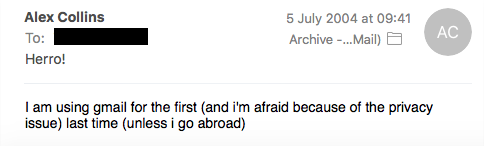
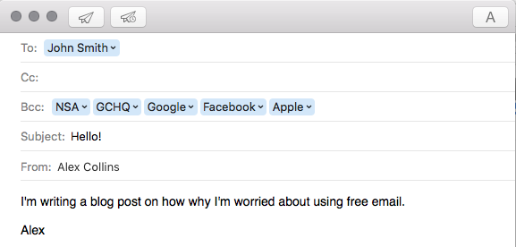
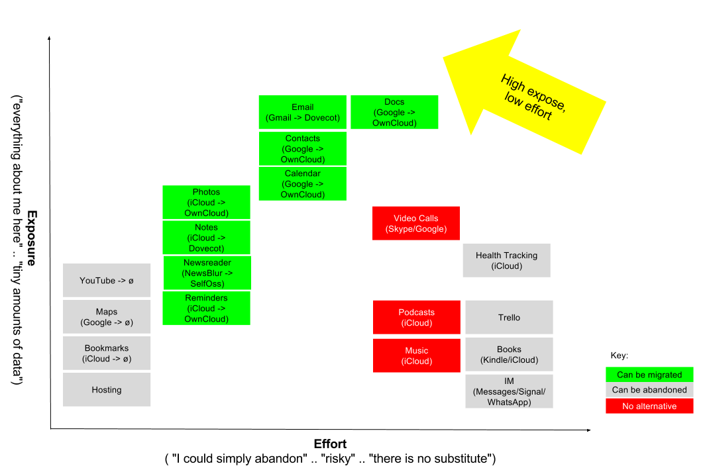

I opened my emails to see how long I had been using Gmail, and found the very first email I sent as long ago as 2014:

I then used Gmail with abandon - but it's clear perhaps I should have stuck with my first instincts.

But didn't I? It was free, it didn't require any effort, and it just worked. Until very recently, I use nearly 20 separate service each day which I share personal information with. From email, to calendars, musical preferences to private documents.

But, the thing is - email, and all these other tools, are really like this:

But today, in 2017, with the Edward Snowden revelations, and the recent Snoopers Charter in the UK, I've made the decision to take back control of my data.

This is not for the feint hearted. You'll need to be technically adept with Unix. You'll need to understand networks, and security.

You'll learn about Postfix, Dovecot, SSL, IMAP, DNS, SPF, DKIM, DMARC, VPNs, PHP (ugh!), MySQL, PostgresQL, Ansible, Crontabs, etc etc etc.

Thankfully this is what's I've been doing for over 15 years!

## Step 1: Where's The 80/20 Split?

I wanted to know where to start first, so I asked myself _"where am I exposing the most data, and where is the easiest to migrate?"_ and produce a diagram:

I discovered a couple of things. The vast majority of my expose was my use of Gmail and Google Drive. Between these two, you can find 99% of the personal data, so these need to be addressed first.

There were a few services (such as Google Maps or YouTube) that I didn't need to be using logged in, as it gave small benefits. Some services you can't leave without being unable to use them. For example, instant messaging and video chat - where you have to use someone else's servers. Or, where you're consuming something they provide you (e.g. music or movies) and the act of consuming it leaks your data.

## Step 2: Make A Plan

I had a look around for how to do this, and luckily came across [Sovereign](https://github.com/sovereign/sovereign). It's essentially a set of Ansible scripts to set-up your own private cloud.

Best not to run before you can walk, but lets summarise the part of Sovereign I ended up using.

* **Dovecot**. This sets up both sending and receive mail (secured with TLS). You can use this for notes too.
* **OwnCloud**. This provides calendar, contacts, reminders, as well as a Dropbox style folder.
* **SelfOSS**. This is a RSS reader.
* **OpenVPN**. As a result of the Snoopers Charter, GCHQ are capturing a list of every website you visit. Including this one - of course.

Now, I know I need my own server, but where should I host it? Not in the UK or the USA obviously. The Netherlands have good privacy laws, so it'll go there!
