Some notes from a recent holiday in Madrid.

We stayed at Room Mate Oscar. It was central, had a great roof bar (Ibiza style), but found it quite noisy at night (due to the roof bar).

We went to all the main places, the highlights were:

* **Retiro Park** - go for a long walk if the weather is good and listen to buskers that are around the lake.
* **Museo Thyssen-Bornemisza** - full of a massive variety of different types of art. Really interesting and engrossing, a must see.
* **Reina Sofia** - modern art, make a special point to see **Gurnica**.
* **Royal Palace** - very similar to other royal palaces in other capital cities.

Allow a 2-3 hours for each of those.

The **Prado** was full of boring religious art. Avoid.

There a few sights that you can just drop by and spend maybe an hour at:

* **Plaza Major** - have a coffee and enjoy the atmosphere.
* **Mercardo San Miguel** or **St Anton Market** - get lunch.
* **Templo Debold** - sunset as an Egyptian temple. Weird opening hours.

A number of museums have free opening times (e.g. after 6pm) but are often open on Mondays. They tend to be within walking distance of one another.

While probably not worthwhile a visit on its own, the **Atocha Train Station** has a wonderful atrium full of plants and animals. Free.

If you have a couple of days, make sure you visit **Toledo**. There's about 5-6 main sights, and they are worthwhile visiting, especially the cathedral. We got straight off the train onto bus tour which took us into town. Normally I hate these, but it (1) gave us a great introduction to the town and (2) got us into town (a very long walk otherwise).

If you visit Toledo, you absolutely must see the cathedral. It is enormous.

Great food is easy to come by, sushi seems to be quite popular. We entertained ourselves by going to one of the many gin bars, and visiting **Cafe Central** to see a jazz concert.

We also went to **Hammam Al Andalus Madrid**. Heh, I just love hammams!

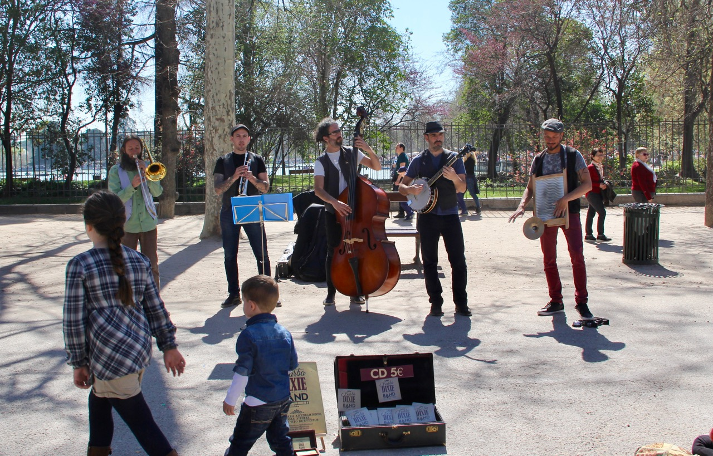
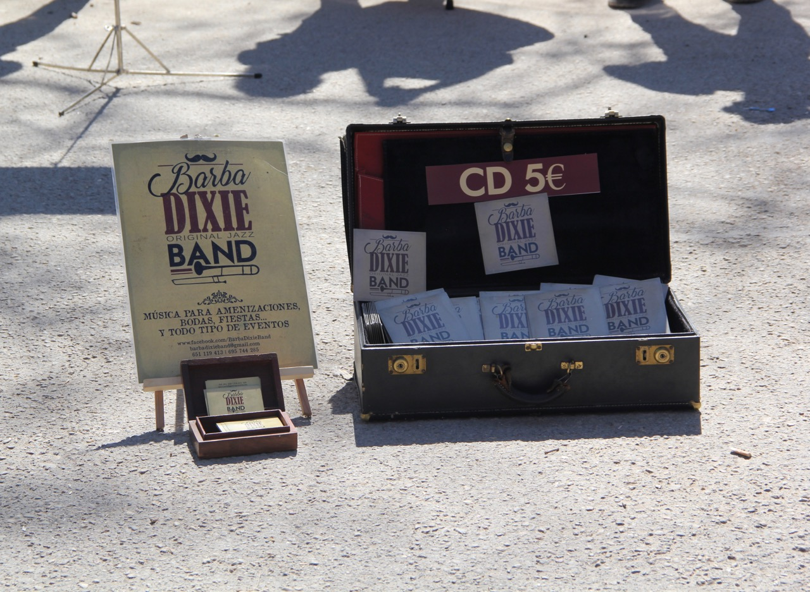
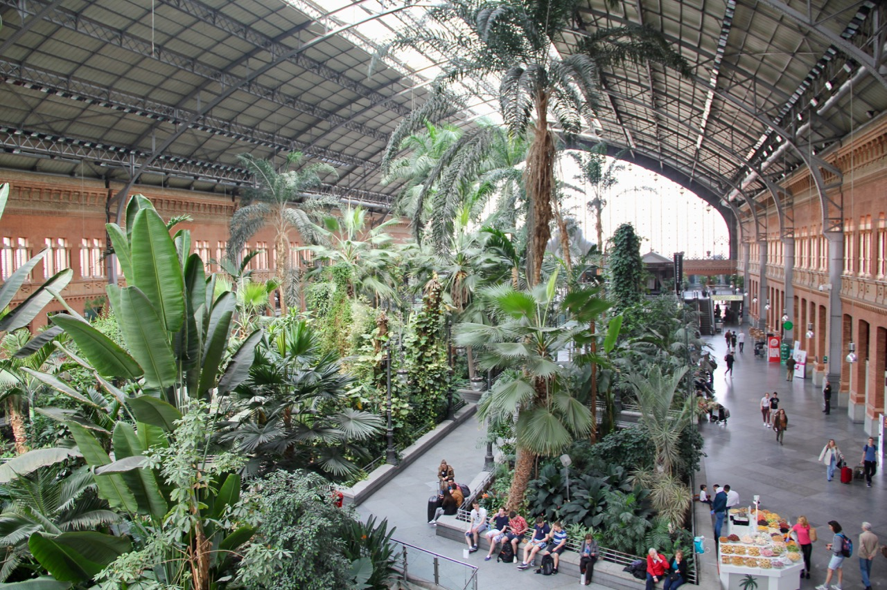
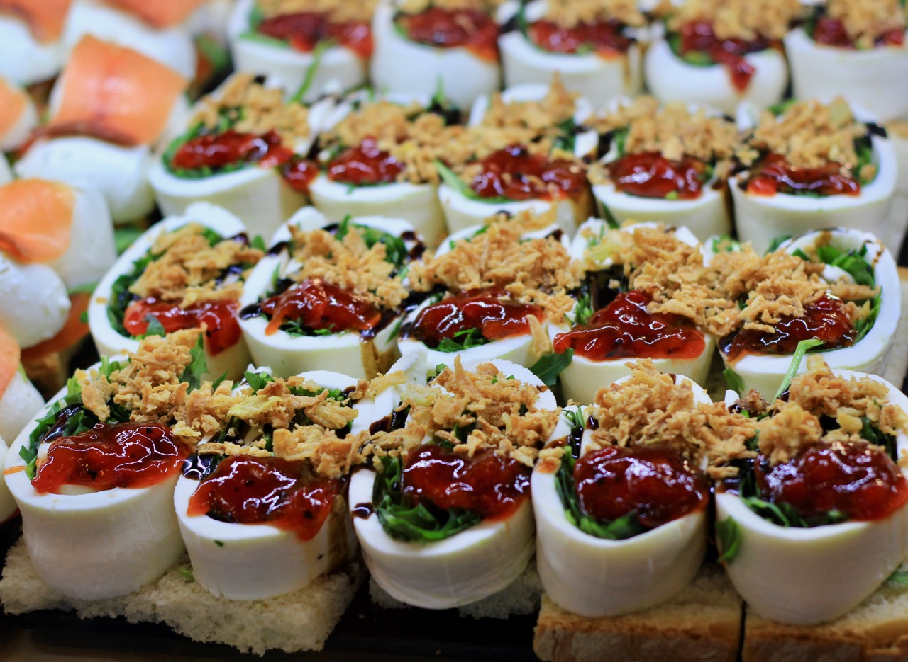
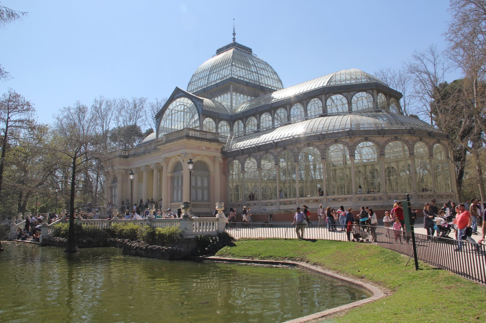
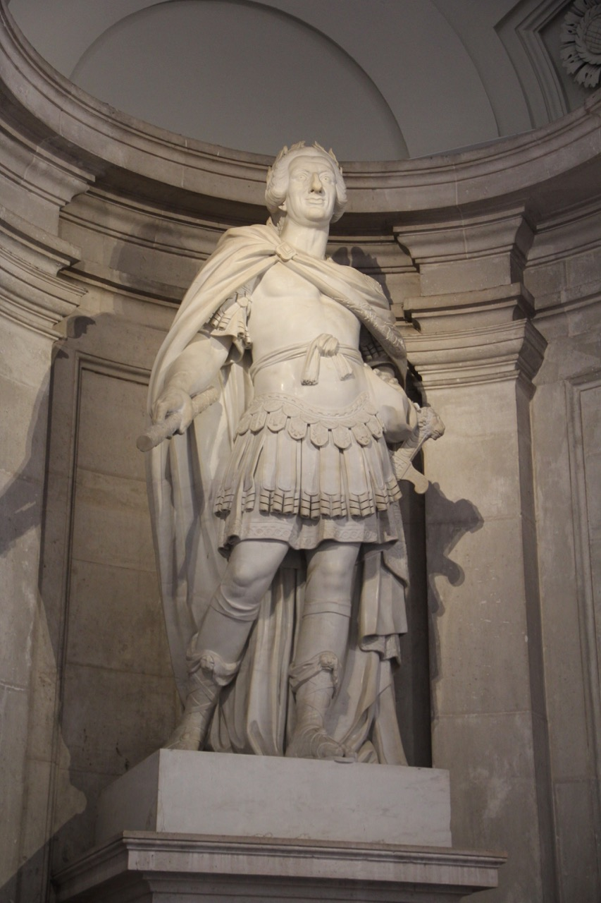
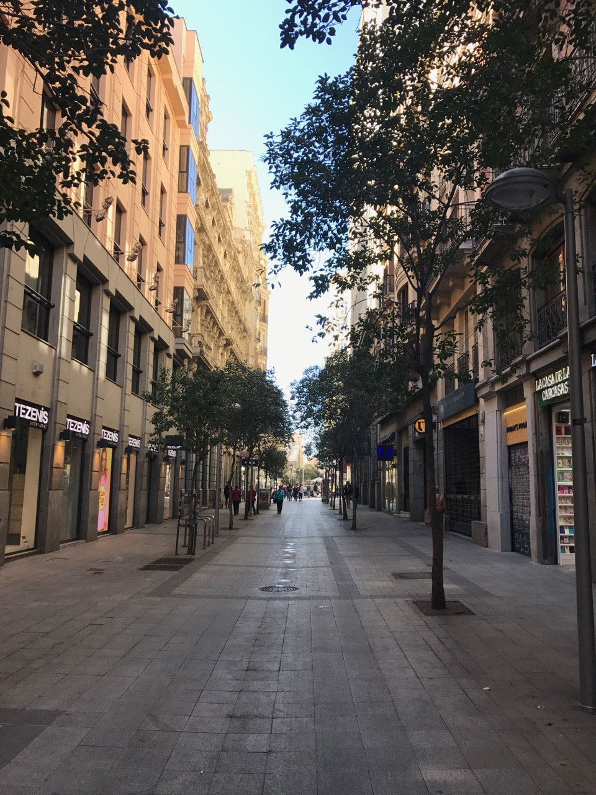
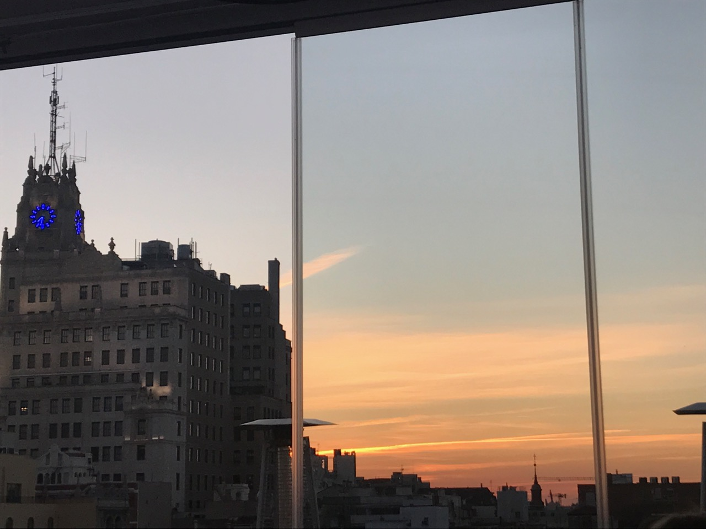
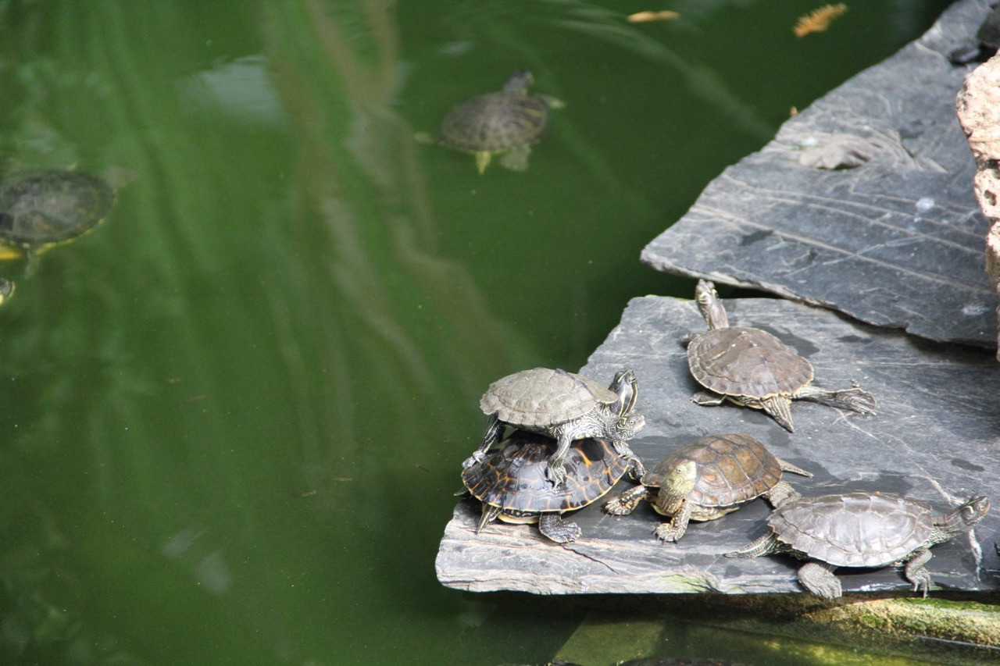
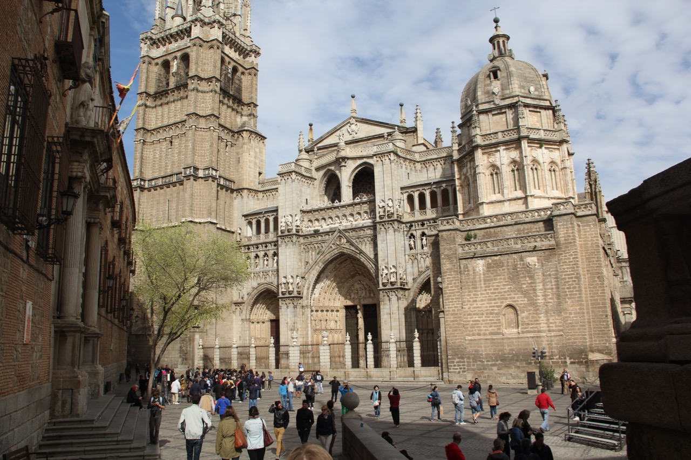
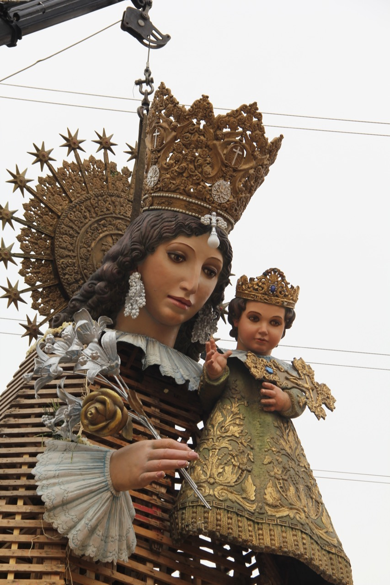
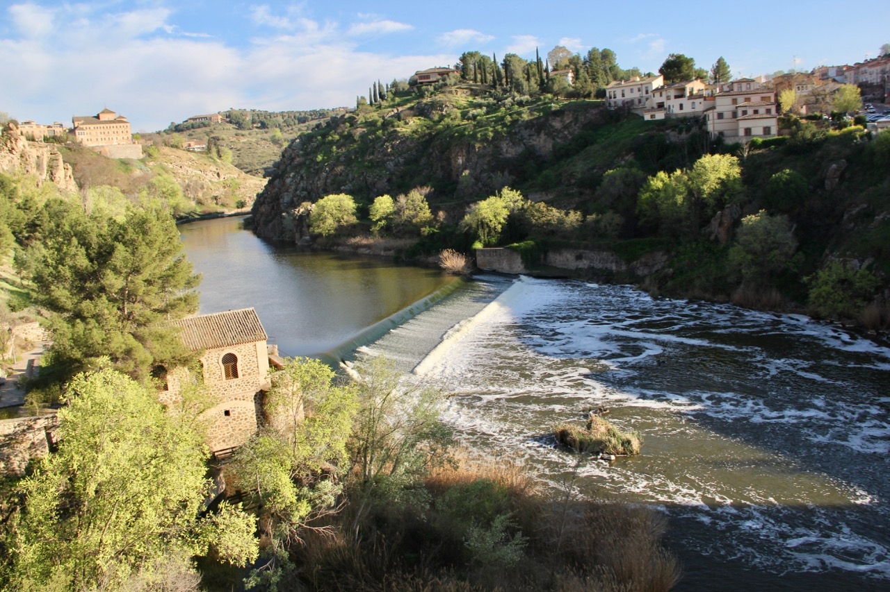
