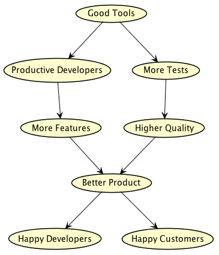

---

title: On Brilliant Building Tools
date: 2017-12-17 19:51 UTC
tags: tools

---
# Why Bad Tools Are Bad

This is easiest explained in a diagram:

Simply put, a good tool allows a developer to deliver customer value quickly and cheaply.

# How To Sniff Out Bad Tools

Bad tooling underlies a number of problems. How do you know if you have bad tools:

* On a scale of 1 to 10, how would you rate your tools?
* If you could change one tool, what would it be, and how?

It's relatively easy to end up with "bad tools".
